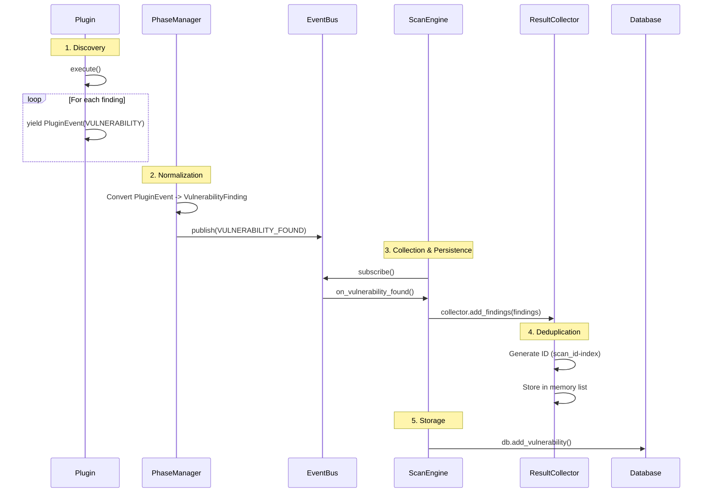

# Deep Architectural Analysis: Trix System

## 1. 🕵️‍♀️ The Lifecycle of a Vulnerability

The path from plugin execution to database persistence.



### Critical Observations
*   **Data Cleaning**: Occurs primarily in `PhaseManager._execute_plugin` where raw plugin events are converted to typed `VulnerabilityFinding` objects.
*   **Deduplication**: Very basic. `ResultCollector` assigns IDs based on list index (`scan_id-{index}`). **No semantic deduplication** (e.g., same URL + same Param + same VulnType = duplicate) seems to exist in the `add_finding` logic viewed.
*   **AI Intervention**:
    *   **Pre-Storage**: AI is **NOT** currently used to filter or validate findings before they hit the `ResultCollector` in the legacy `ScanEngine` flow.
    *   **Verification**: The `ScanController` (AI-native) does use `LLMJudge` *before* yielding findings, but the `ScanEngine` (using standard plugins) reports everything the plugin yields.

## 2. 🧠 AI Intervention Points

Analysis of `trix/engine/scan_engine.py` and `trix/core/concurrent_executor.py`.

### Pre-Execution (Payload Generation)
*   **Location**: `BasePlugin.mutate_payload_with_ai` (Node 3)
*   **Status**: Manually called by specific plugins. Not part of the automatic flow yet.
*   **Intervention**: In `ScanController._scan_with_plugin`, context is created and `plugin.generate_payloads` is called. This is the place to inject AI mutation.

### Post-Execution (Judgment)
*   **Location**: `LLMJudge.judge`
*   **Status**: Used by `ScanController` (LLM-native flow).
*   **Legacy Interop**: `ScanEngine` does *not* seem to call `LLMJudge` for standard plugins like `URLFinder`.
*   **WAF Bypass**: `ConcurrentExecutor` automatically triggers `WAFBypassHandler` (Node 4) on 403/429.

### Feedback Loop
*   **Location**: `ScanEngine._run_scan_loop` (lines 466-502)
*   **Mechanism**:
    1.  Checks `self._get_pending_verification_tasks(scan_id)`.
    2.  Converts `VerificationTask` -> `ScanTask(VERIFICATION)`.
    3.  Injects into `task_queue` with `HIGH` priority.
*   **Issue**: How do `VerificationTasks` enter the pending list? They are generated by `LLMJudge.generate_verification_task`, but `ScanEngine` mainly runs standard plugins. The bridge between standard plugin findings and AI verification needs to be explicit (e.g., an event listener that catches `VULNERABILITY_FOUND` and triggers an async verification task).

## 3. 🚦 State Machine & Task Flow

### Flow Structure: Cyclic / Dynamic
The `ScanEngine._run_scan_loop` (lines 458-591) is a **dynamic while-loop**, not a linear phase execution.

```python
# trix/engine/scan_engine.py

while not task_queue.empty() or active_tasks:
    # 1. Inject AI Verification Tasks (Priority Interrupt)
    verification_tasks = self._get_pending_verification_tasks(scan_id)
    for v in verification_tasks:
        queue.put(ScanTask(VERIFICATION, ..., priority=HIGH))

    # 2. Get Next Task
    task = await queue.get()
    
    # 3. Execute
    result, new_tasks = await self._execute_task(task, ...)
    
    # 4. Feedback Loop (New Discovery)
    for new_task in new_tasks:
        await queue.put(new_task)  # <--- Logic for adding fresh discovery back
```

*   **Discovery Feedback**: Yes. `_execute_task` returns `new_tasks`. For example, `UrlFinder` finding new URLs can spawn new `TaskType.URL` tasks, which are added back to the queue.

## 4. 🧬 Critical Data Structures

### ScanTask
`trix/engine/scan_task.py`
Determines what information is carried through the queue.
```python
@dataclass
class ScanTask:
    scan_id: str
    task_type: TaskType          # PHASE, PLUGIN, VERIFICATION, URL, etc.
    target: str                  # URL or IP
    task_id: str
    priority: TaskPriority       # CRITICAL, HIGH, NORMAL, LOW
    
    # Context
    phase: str | None            # logic group
    plugin: str | None           # specific tool
    parameters: dict[str, Any]   # Payload, headers, custom args
    
    # Lineage
    parent_task_id: str | None
    depth: int                   # Recursion control
```

### VulnFinding
`trix/models/finding.py`
The standard output format.
```python
@dataclass
class VulnFinding:
    # Core
    target: str
    vuln_type: str
    payload: str
    
    # Evidence
    raw_request: str
    raw_response: str
    
    # AI Judgment
    llm_reasoning: str           # "Why is this a vuln?"
    confidence_score: float      # 0.0 - 1.0
    confidence_level: Enum       # CONFIRMED, LIKELY, SUSPECTED, FALSE_POSITIVE
    risk_level: Enum             # CRITICAL...INFO
    
    # Metadata
    plugin_name: str
    evidence: list[str]
    http_poc: str                # Raw HTTP request PoC (Node 5)
```

### PayloadContext
Inferred from `ScanController`. Used by plugins to generate payloads.
```python
@dataclass
class PayloadContext:
    target: str
    parameter: str
    method: str
    # Missing: Page content/DOM source? (Limitation for Node 3 mutation if context is needed)
```
